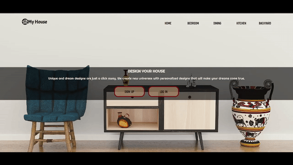

# <a href="https://malibilmez.github.io/MyHouse/">My House</a> 

## This is a single-page website created using the "position" property in CSS, which I am currently learning :).

This project serves as a practice exercise to deepen my understanding of CSS positioning techniques. The website demonstrates various applications of the position property, including static, relative, absolute. As I'm still in the learning phase, this site is a work in progress and may be updated as I continue to explore and master CSS.

